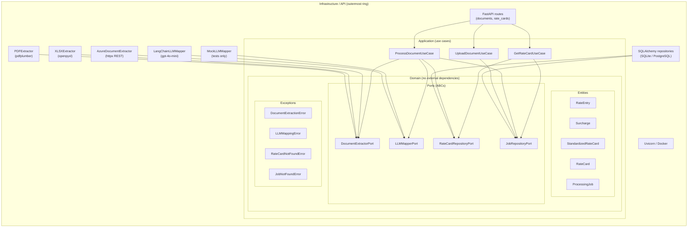
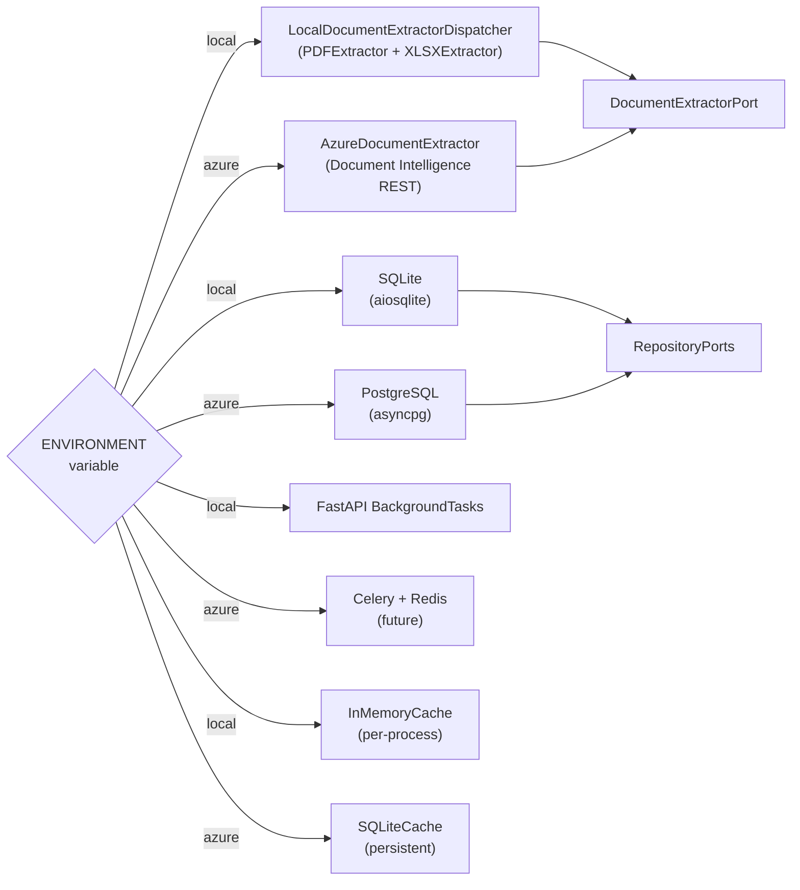
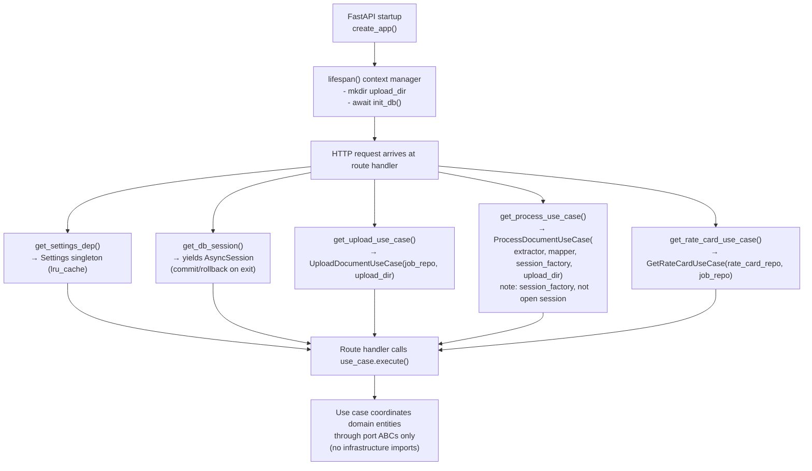
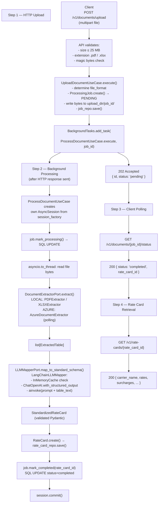

# Architecture: Rate Card Converter

## Hexagonal Architecture Overview

The system is organized in concentric rings. Each ring depends only on rings
closer to the center. The domain layer has zero external dependencies.

Arrows point **inward only**: Infrastructure imports from Application and
Domain. Application imports from Domain. Domain imports nothing external.



---

## Port Definitions and Adapters

| Port (ABC)             | Methods                         | Local Adapter                                             | Azure Adapter              |
|------------------------|---------------------------------|-----------------------------------------------------------|----------------------------|
| DocumentExtractorPort  | extract(bytes, filename)        | LocalDocumentExtractorDispatcher (routes to PDF / XLSX)   | AzureDocumentExtractor     |
| LLMMapperPort          | map_to_standard_schema(...)     | LangChainLLMMapper (gpt-4o-mini) / MockLLMMapper (tests)  | LangChainLLMMapper (same)  |
| RateCardRepositoryPort | save, get_by_id, list_all       | SQLiteRateCardRepository                                  | PostgresRateCardRepository |
| JobRepositoryPort      | save, get_by_id, update_status  | SQLiteJobRepository                                       | PostgresJobRepository      |

---

## Adapter Selection by Environment

The `src/config/container.py` module is the **only** place in the codebase where
`settings.environment` is read to select adapters. All other code depends only on
port abstractions.



| Component           | ENVIRONMENT=local                      | ENVIRONMENT=azure                      |
|---------------------|----------------------------------------|----------------------------------------|
| Document extraction | LocalDocumentExtractorDispatcher       | AzureDocumentExtractor                 |
| LLM mapping         | LangChainLLMMapper (gpt-4o-mini)       | LangChainLLMMapper (gpt-4o-mini)       |
| LLM caching         | InMemoryCache (per process)            | SQLiteCache (persistent)               |
| Database            | SQLite via aiosqlite                   | PostgreSQL via asyncpg                 |
| Task processing     | FastAPI BackgroundTasks                | Celery + Redis (future)                |
| Repositories        | SQLiteJobRepository                    | PostgresJobRepository                  |
|                     | SQLiteRateCardRepository               | PostgresRateCardRepository             |

---

## Dependency Injection Flow



---

## Data Flow: Upload to Rate Card Retrieval



---

## Testing Strategy

The test suite is designed to run with zero external service calls:

| Test Layer    | Dependencies Replaced                                          | Tests Verify                                              |
|---------------|----------------------------------------------------------------|-----------------------------------------------------------|
| Unit tests    | MockDocumentExtractor, MockLLMMapper, MockJobRepository,       | Extractor parsing, mapper invocation,                     |
|               | MockRateCardRepository, in-memory SQLite (db_session fixture)  | use case state machine logic                              |
| Integration   | All infrastructure via dependency_overrides in FastAPI,        | HTTP status codes, response schemas,                      |
|               | ImmediateProcessUseCase (synchronous test double)              | full upload → status → retrieval flow                     |

LangChainLLMMapper with a real OpenAI API is tested manually:
```bash
python samples/generate_samples.py
# then upload via curl or the /docs Swagger UI
```

---

## Extension Points

### Adding a New Document Extractor

1. Create `src/infrastructure/extractors/my_extractor.py` implementing `DocumentExtractorPort`.
2. Register in `src/config/container.py` `get_document_extractor()` under the appropriate condition.
3. No changes required in any use case or API code.

### Adding a New LLM Provider

1. Create `src/infrastructure/mappers/my_mapper.py` implementing `LLMMapperPort`.
2. Update `get_llm_mapper()` in `src/config/container.py`.
3. No application or API code changes required.

### Adding a New API Endpoint

1. Add route handler in the appropriate `src/api/v1/routes/*.py` file.
2. Add the corresponding use case method (or new use case class) in `src/application/`.
3. Use cases depend on ports — no infrastructure imports needed.
