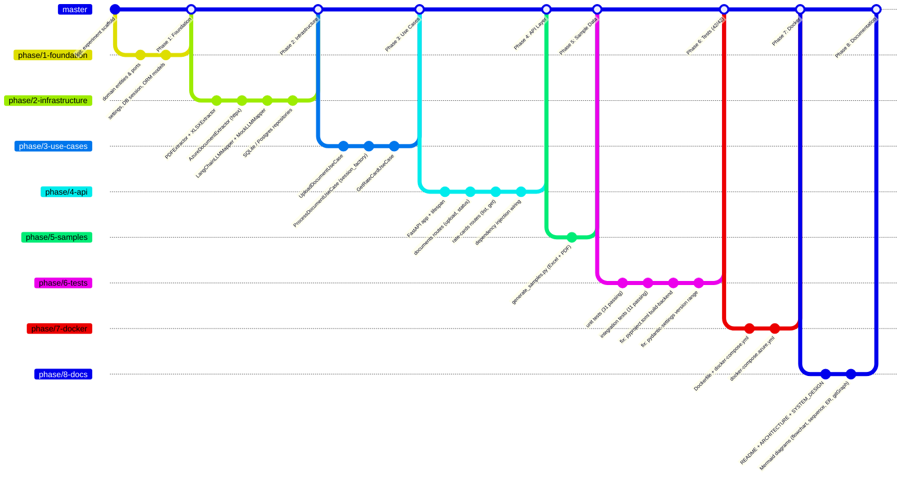

# Rate Card Converter

A production-grade document parsing service that converts freight carrier rate
cards from heterogeneous formats (PDF, Excel) into a standardized canonical schema
using LLM-assisted semantic field mapping.

Built as a learning lab experiment demonstrating Hexagonal Architecture (Ports and
Adapters) with FastAPI, LangChain, SQLAlchemy, and OpenAI GPT-4o-mini.

---

## Architecture

The system uses Hexagonal Architecture. Business logic lives in the domain layer
and is accessed only through abstract port interfaces. Infrastructure adapters
(pdfplumber, openpyxl, LangChain, SQLAlchemy) implement those ports and are
selected at startup based on the ENVIRONMENT variable. No application code changes
are required to switch between local and Azure deployments.

See [ARCHITECTURE.md](ARCHITECTURE.md) for diagrams, port/adapter tables, and
data flow descriptions. See [SYSTEM_DESIGN.md](SYSTEM_DESIGN.md) for the data
model, sequence diagrams, and scaling strategies.

---

## Quick Start

**Requirements:** Python 3.10+, pip

```bash
# 1. Navigate to the project directory
cd experiments/2024-10-15-rate-card-converter

# 2. Install dependencies
pip install -e ".[dev]"

# 3. Configure environment (set OPENAI_API_KEY)
cp .env.example .env
# Edit .env and set your OPENAI_API_KEY

# 4. Generate sample files and test fixtures
python samples/generate_samples.py --test-fixtures

# 5. Start the development server
uvicorn src.api.app:app --reload

# API is now running at http://localhost:8000
# Interactive docs: http://localhost:8000/docs
```

---

## API Reference

| Method | Path                              | Description                                      | Response |
|--------|-----------------------------------|--------------------------------------------------|----------|
| POST   | /v1/documents/upload              | Upload a PDF or Excel rate card for processing   | 202      |
| GET    | /v1/documents/{job_id}/status     | Poll the processing status of an uploaded job    | 200      |
| GET    | /v1/rate-cards/{rate_card_id}     | Retrieve the fully processed rate card           | 200      |
| GET    | /v1/rate-cards/                   | List all stored rate cards (paginated)           | 200      |

### Upload a Document

```bash
curl -X POST http://localhost:8000/v1/documents/upload \
  -F "file=@samples/sample_rate_card.xlsx"
```

Response:
```json
{
  "id": "550e8400-e29b-41d4-a716-446655440000",
  "filename": "sample_rate_card.xlsx",
  "status": "pending",
  "rate_card_id": null,
  "error_message": null,
  "created_at": "2024-10-15T12:00:00",
  "updated_at": "2024-10-15T12:00:00"
}
```

### Poll Job Status

```bash
curl http://localhost:8000/v1/documents/550e8400-e29b-41d4-a716-446655440000/status
```

### Retrieve the Rate Card

```bash
curl http://localhost:8000/v1/rate-cards/{rate_card_id}
```

---

## Environment Variables

| Variable                              | Default                                   | Description                                      |
|---------------------------------------|-------------------------------------------|--------------------------------------------------|
| ENVIRONMENT                           | local                                     | Runtime mode: local or azure                     |
| OPENAI_API_KEY                        | (required)                                | OpenAI API key for LLM semantic mapping          |
| OPENAI_MODEL                          | gpt-4o-mini                               | OpenAI model identifier                          |
| OPENAI_MAX_TOKENS                     | 2048                                      | Maximum tokens for LLM output                   |
| OPENAI_TEMPERATURE                    | 0                                         | Sampling temperature (0 = deterministic)         |
| DATABASE_URL                          | sqlite+aiosqlite:///./rate_cards.db       | SQLAlchemy async connection string               |
| UPLOAD_DIR                            | ./uploads                                 | Directory for uploaded document storage          |
| LOG_LEVEL                             | INFO                                      | Python logging level                             |
| AZURE_DOCUMENT_INTELLIGENCE_ENDPOINT  | (empty)                                   | Azure Document Intelligence endpoint (azure only)|
| AZURE_DOCUMENT_INTELLIGENCE_KEY       | (empty)                                   | Azure Document Intelligence API key (azure only) |
| REDIS_URL                             | redis://localhost:6379/0                  | Redis URL for Celery broker (azure only)         |
| POSTGRES_URL                          | (empty)                                   | PostgreSQL URL (overrides DATABASE_URL in azure) |

---

## Running Tests

```bash
# All tests (unit + integration, no real API calls)
pytest tests/ -v

# Unit tests only
pytest tests/unit/ -v

# Integration tests only
pytest tests/integration/ -v

# With coverage report
pytest tests/ --cov=src --cov-report=term-missing
```

All automated tests use MockLLMMapper and in-memory SQLite. No OpenAI API calls
are made during the test suite. Expected runtime: under 30 seconds.

---

## Docker

### Local development (SQLite, no Redis)

```bash
docker compose up --build
```

### Azure production simulation (PostgreSQL + Redis)

```bash
docker compose -f docker-compose.yml -f docker-compose.azure.yml up --build
```

---

## Generating Sample Files

The `samples/generate_samples.py` script creates synthetic rate card documents
that demonstrate the system's field mapping capabilities:

```bash
# Generate full samples in samples/ directory
python samples/generate_samples.py

# Also generate minimal test fixtures in tests/fixtures/
python samples/generate_samples.py --test-fixtures
```

**sample_rate_card.xlsx** - FastFreight Logistics, weights in pounds (USD/lb),
non-standard column headers. Tests the LLM's unit conversion and header mapping.

**sample_rate_card.pdf** - FreshCargo GmbH, weights in kg (EUR/kg), text-based PDF.
Tests PDF table extraction and currency/carrier name inference.

---

## Cost Notes

- Default model is `gpt-4o-mini` (~15x cheaper than `gpt-4o`).
- `temperature=0` and `max_tokens=2048` minimize token consumption.
- `InMemoryCache` in LangChain prevents redundant API calls for identical inputs.
- Table text is truncated to 6000 characters per document (~1500 input tokens).
- Estimated cost: approximately $0.0005 per document at gpt-4o-mini pricing.
- Expected cost for a full manual test run (2-3 documents): under $0.05.

---

## Phase Roadmap

| Phase | Description                         | Status   |
|-------|-------------------------------------|----------|
| 1     | Foundation (domain, config, DB)     | Complete |
| 2     | Infrastructure adapters             | Complete |
| 3     | Application use cases               | Complete |
| 4     | API layer (FastAPI)                 | Complete |
| 5     | Synthetic sample data               | Complete |
| 6     | Unit and integration tests          | Complete |
| 7     | Docker configuration                | Complete |
| 8     | Documentation                       | Complete |

The phases above map to the following Git history. Each phase was developed on
its own branch and merged back to `master` after all tests passed:


