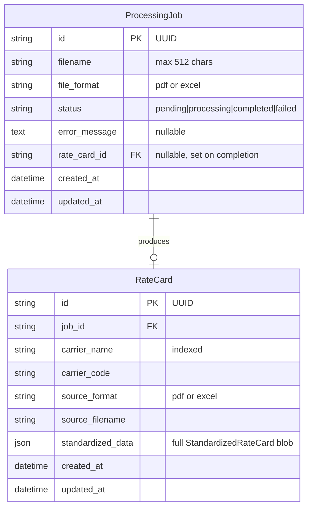
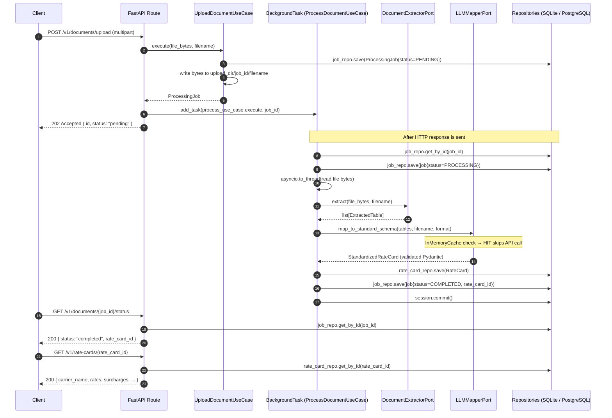
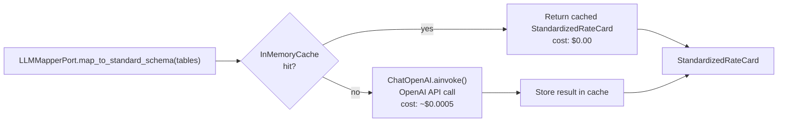
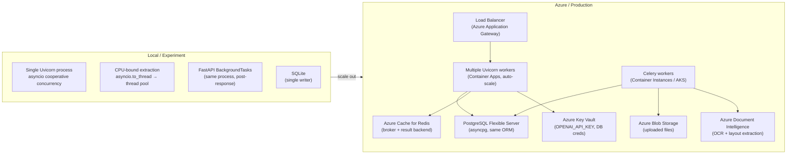
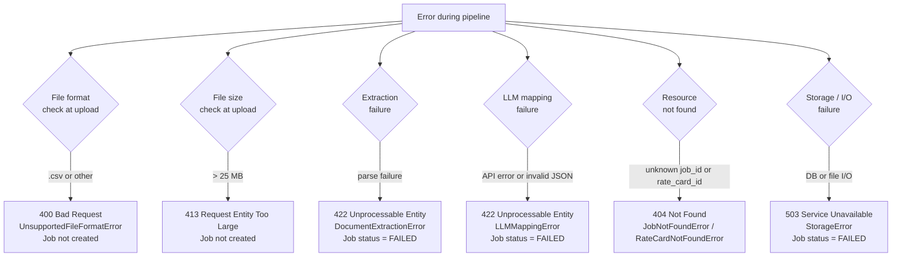

# System Design: Rate Card Converter

## Data Model



**Denormalization note:** `StandardizedRateCard` (with nested rates and surcharges)
is stored as a JSON blob rather than normalized into separate tables. This is
appropriate for the current scope: the primary access pattern is retrieve-by-id
and the full card is always needed together. For production use with filtering or
aggregation requirements, individual rate entries should be extracted to a
`rate_entries` table with an FK to `rate_cards`.

---

## Document Processing Sequence Diagram



---

## LLM Integration Design

### Prompt Architecture

The system prompt is static (same for every call) and deliberately long (>1024
tokens) to benefit from OpenAI's automatic prompt caching (50% cost reduction on
cached prefix tokens). Variable document content goes in the human message.

```
[System message — static, >1024 tokens, cached after first call]
  "You are a logistics data extraction specialist..."
  Extraction rules (field mapping, unit conversion, normalization)

[Human message — variable, not cached]
  "Source filename: {filename}"
  "Source format: {format}"
  "Extracted document content:"
  "{table_text}"  (truncated to 6000 chars)
```

### Structured Output

`ChatOpenAI.with_structured_output(StandardizedRateCard, method="function_calling")`
binds the LLM to respond with JSON that matches the Pydantic v2 schema. OpenAI's
function calling mechanism validates the response structure. If validation fails,
LangChain raises an exception that is wrapped as `LLMMappingError`.

**Pydantic v2 constraint:** OpenAI's function calling JSON Schema rejects
`minimum`, `maximum`, `minLength`, `maxLength` properties. The `StandardizedRateCard`
schema uses no `ge`/`le`/`min_length` Pydantic field validators for this reason.

### Caching



`InMemoryCache` is per-process and non-persistent. It prevents redundant API
calls when the same document is re-uploaded within the same server session.
For production, `SQLiteCache` persists across restarts.

### Token Budget Calculation (gpt-4o-mini pricing, 2024)

| Component           | Tokens | Cost per document     |
|---------------------|--------|-----------------------|
| System prompt       | ~400   | cached after 1st call |
| Table text (6000ch) | ~1500  | $0.000225 (input)     |
| Response (2048 max) | ~500   | $0.000300 (output)    |
| **Total**           | ~2400  | **~$0.0005**          |

---

## Scaling Strategies



**Throughput estimate per worker:**
- LLM call: ~3–5 s (network + model inference)
- Extraction: ~0.5–2 s (CPU-bound, thread pool)
- Total pipeline: ~4–7 s per document
- Throughput: ~8–15 documents/minute per worker
- Scale to 10+ workers for batch processing of hundreds of documents

**Celery migration path (single line change in `container.py`):**
```python
# Before (local):
background_tasks.add_task(process_use_case.execute, job_id)

# After (Azure):
celery_app.send_task("process_document", args=[job_id], queue="document_processing")
```
Workers scale independently of API replicas. `task_acks_late=True` and
`max_retries=3` ensure at-least-once delivery with exponential backoff.

---

## Error Handling Matrix



| Error                      | Cause                               | HTTP | Job status | Retry?                   |
|----------------------------|-------------------------------------|------|------------|--------------------------|
| UnsupportedFileFormatError | .csv or other unsupported extension | 400  | N/A        | No                       |
| File too large             | > 25 MB upload                      | 413  | N/A        | No                       |
| DocumentExtractionError    | pdfplumber / openpyxl parse failure | 422  | FAILED     | Retry with different file |
| LLMMappingError            | OpenAI API error or invalid output  | 422  | FAILED     | Retry (transient)         |
| JobNotFoundError           | Unknown job_id                      | 404  | N/A        | No                       |
| RateCardNotFoundError      | Unknown rate_card_id                | 404  | N/A        | No                       |
| StorageError               | DB or file I/O failure              | 503  | FAILED     | Yes (infrastructure)      |

---

## Security Considerations

**API key management:**
- `OPENAI_API_KEY` is read from environment variables, never hardcoded.
- In production, source from Azure Key Vault via Managed Identity.

**File upload security:**
- Maximum upload size enforced at the API layer (25 MB).
- File type validation uses magic bytes (first 4–8 bytes), not extension alone.
- Uploaded files stored in a job-specific subdirectory to prevent path traversal.

**No authentication (current scope):**
- This experiment does not implement authentication or authorization.
- In production, add OAuth2 Bearer token validation using FastAPI's
  `OAuth2PasswordBearer` and Azure Active Directory app registration.

---

## Known Limitations

1. No authentication or authorization. All endpoints are publicly accessible.
2. No rate limiting. A single client can flood the upload endpoint.
3. SQLite is not suitable for concurrent writes from multiple processes.
4. LLM output is not fully deterministic despite `temperature=0` (model
   randomness at low probability tokens). InMemoryCache mitigates repeat calls.
5. PDF text extraction quality depends on whether the PDF is text-based or
   scanned (image). Scanned PDFs require OCR (Azure Document Intelligence handles this).
6. No file cleanup: uploaded files in `./uploads/` are never automatically deleted.
