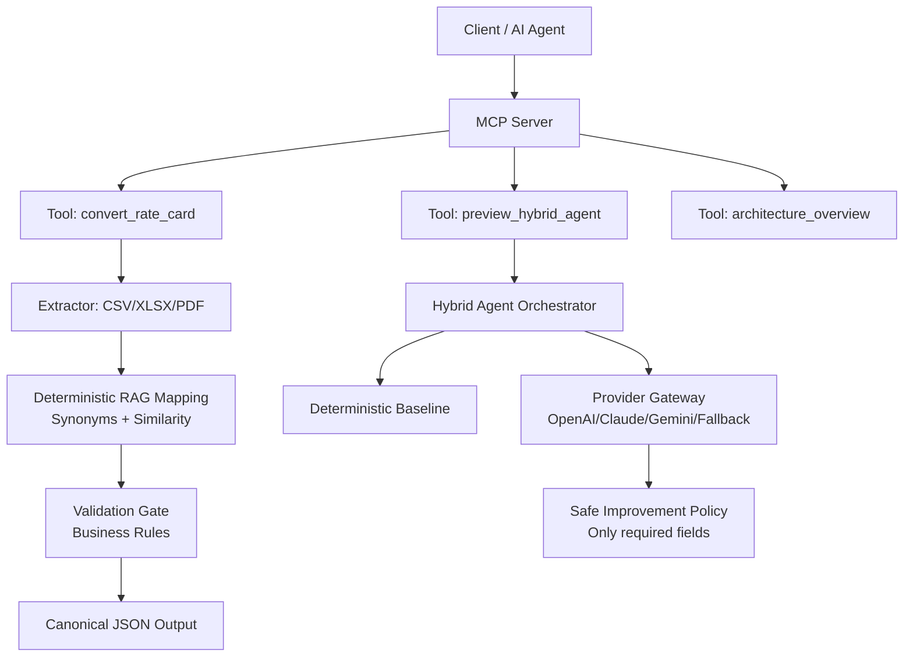

# MCP Server Blueprint: Hybrid RAG + Agentic Rate Card Conversion

This folder adds an **educational MCP server** on top of the rate-card converter so you can discuss:

- API backend architecture that scales.
- RAG for semantic schema mapping.
- Hybrid deterministic + LLM agent patterns.
- Multi-provider LLM strategy (OpenAI, Claude, Gemini).
- Self-improving loops with safety constraints.

---

## 1) Interview-friendly architecture



### Why this is "pure architecture"

- Each layer has a single responsibility.
- Tool contract (MCP) is stable; internals can evolve.
- LLM providers are abstracted behind one interface.
- Deterministic fallback ensures reproducible behavior.

---

## 2) Data flow

1. **Ingest** file path from MCP tool.
2. **Extract** table into DataFrame.
3. **Map schema** via deterministic retrieval.
4. **(Optional) Hybrid improve** using provider suggestions.
5. **Validate** required fields and business constraints.
6. **Return canonical JSON** plus evidence/warnings.

---

## 3) RAG pipeline (schema understanding)

This project uses a lightweight RAG pattern:

- **Knowledge base** = canonical field definitions + synonyms.
- **Retrieve** best target fields for each source column.
- **Score** with string similarity.
- **Accept/Reject** by threshold.

This is intentionally deterministic for safety-critical pricing data.

---

## 4) Provider-ready API design

`app/llm_gateway.py` contains a provider factory with these targets:

- `OpenAIProvider`
- `ClaudeProvider`
- `GeminiProvider`
- `DeterministicFallbackProvider`

In production you replace stub logic with real SDK calls, preserving the same interface.

---

## 5) Self-improvement without unsafe autonomy

`app/agentic_orchestrator.py` demonstrates a controlled "agent improves itself" loop:

- Start with deterministic baseline mapping.
- Ask provider for hints.
- Apply only safe changes (required fields only).
- Emit explicit suggestions for audit.

This is good for interview discussion: autonomous behavior with guardrails.

---

## 6) Run MCP server

```bash
cd experiments/rate-card-conversion
pip install -e '.[dev,mcp]'
python -m mcp_server.server
```

Example tools available:

- `convert_rate_card(file_path)`
- `preview_hybrid_agent(file_path, provider="openai")`
- `architecture_overview()`

---

## 7) Scale roadmap (what to say in interview)

- Add async queue for heavy PDFs.
- Persist mapping lineage and confidence history.
- Add HITL queue for low-confidence conversions.
- Add golden datasets and regression scoring.
- Add per-provider latency/cost routing policy.
- Add tenant-aware policy engine for validation.
